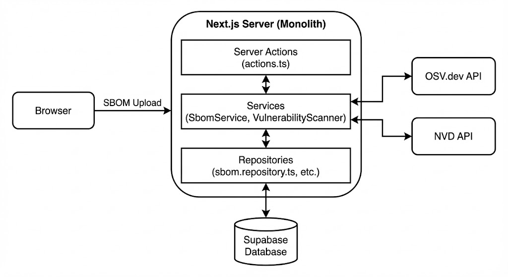

# 5teen: CRA Compliance Management Platform
### Secure Software Development Exam - E2025
Tomas Dracka

---

## 1. The Problem Scope (Agramkow & The CRA)

* **The Reality:** Agramkow develops industrial software and must comply with the new EU Cyber Resilience Act (CRA).
* **The Requirements:**
    * **Article 14:** Continuous vulnerability management (not just one-time scans).
    * **Article 15:** Report actively exploited vulnerabilities within **24 hours**.
    * **Annex I:** Provide audit-ready documentation of secure processes.
* We could generate SBOMs, but an SBOM is just a static list. It doesn't track deadlines or document workflows.

---

## 2. The Gap & The Solution

* **The Gap:** Agramkow lacked the infrastructure to translate a static SBOM into a dynamic, 24-hour compliance workflow.
* **The Solution: 5teen**
    * A lightweight, purpose-built platform to bridge technical findings with legal deadlines.
    * Focuses on ingesting SBOMs, scanning against OSV.dev/NVD, and immediately starting the 24-hour reporting clock.
    * Generates audit-ready PDF reports for regulators.

---

## 3. Technical Architecture & Security Decisions

* **Architecture:** Next.js Monolith with Supabase (PostgreSQL + Auth).
* **Secure by Design Principles Applied:**
    1.  **Defense in Depth (Database):** We don't just rely on app logic. We use PostgreSQL **Row Level Security (RLS)** policies to ensure multi-tenant isolation at the data layer.
    2.  **Validate All Inputs (Trust Boundary):** The browser is untrusted. All data hitting Server Actions is sanitized using **Zod schemas** before reaching business logic.
    3.  **Least Privilege:** Supabase Auth ensures users only access their organization's data.

---

## 4. The Comparison: 5teen vs. OWASP Dependency-Track

| Feature | OWASP Dependency-Track | 5teen (My Project) |
| :--- | :--- | :--- |
| **Scope** | Enterprise-grade Software Supply Chain Risk Management. | Lightweight CRA Workflow & Deadline Management. |
| **Complexity** | High. Requires significant infrastructure and setup. | Low. Purpose-built for immediate CRA workflow gaps. |
| **CRA Focus** | Can provide data *for* compliance, but isn't built *around* the 24h deadline. | **Built specifically around CRA Article 15 (24h deadline) and Annex I reporting.** |
| **Use Case** | Deep, long-term risk analysis across thousands of projects. | Immediate operational compliance for SMEs like Agramkow. |

---

## 5. Demo

